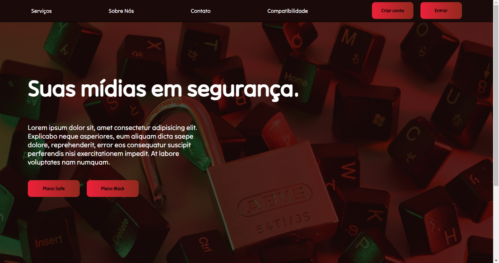

# WebSite w/ React (in progress)
 

> Landing page SafeLock

Front-end de um WebSite "SafeLock" (Empresa fictícia que faria o papel de proteger dados sensíveis) para praticar o uso do React. O site irá conter páginas de: login, signUp e de navegação.

## 🚀 Tecnologias

- Javascript
- ESLint
- React
- React-dom
- Styled Components
- Vite
- CSS
- HTML
- Git e Github

## 📞 Contato

>rafael.loren175@gmail.com

>+55 (11) 99959-9140

## 👾 Discord

>rafas#7622
